<p align="center">
  
</p>

<h1 align="center">OpenShift Pulse</h1>

<p align="center">
  <strong>Next-generation OpenShift Console for Day-2 Operations</strong><br>
  <em>Built for the platform engineer who checks their cluster at 8am Monday morning.</em>
</p>

<p align="center">
  <a href="https://github.com/alimobrem/OpenshiftPulse/releases/tag/v6.2.0"></a>
  
  
  
  
</p>

<p align="center">
  <a href="#-quick-start">Quick Start</a> &bull;
  <a href="#-screenshots">Screenshots</a> &bull;
  <a href="#-features">Features</a> &bull;
  <a href="#-deploy-to-openshift">Deploy</a> &bull;
  <a href="API_CONTRACT.md">API Contract</a> &bull;
  <a href="SECURITY.md">Security</a> &bull;
  <a href="CHANGELOG.md">Changelog</a>
</p>

---

Real-time Kubernetes dashboard built with React, TypeScript, and WebSocket watches. Browse any resource type, see what needs attention, and take action — all through your cluster's OAuth. No external database. No agents to install. Just deploy and go.

### Why Pulse?

| | OpenShift Console | Lens | Rancher | **Pulse** |
|---|:---:|:---:|:---:|:---:|
| AI-powered SRE agent (Claude) | | | | **Yes** |
| Multi-cluster fleet dashboard | | | Yes | **Yes** |
| Cross-cluster search & comparison | | | Partial | **Yes** |
| Fleet compliance matrix | | | | **Yes** |
| 77 automated health checks with YAML fixes | | | | **Yes** |
| ArgoCD integration with auto-PR on save | | | | **Yes** |
| Incident correlation timeline | | | | **Yes** |
| Capacity planning with projections | | | | **Yes** |
| HyperShift / ROSA native | Partial | | | **Yes** |
| In-browser pod terminal | Yes | Yes | Yes | **Yes** |
| Zero install (OAuth SSO) | Yes | | | **Yes** |

---

## Prerequisites

- **Node.js 24+** and **pnpm** — for building the UI
- **OpenShift 4.14+** or **ROSA** — with OAuth proxy support
- **Podman** or **Docker** — for building container images
- **Helm 3+** — for deployment
- **oc CLI** — logged into target cluster
- **Container registry** — writable push access (Quay.io, Docker Hub, etc.)

### Fork & Deploy Checklist

If you're deploying your own instance, here's what to change:

| What | Where | Default | Change to |
|------|-------|---------|-----------|
| **Container registry** | env vars or Helm values | `quay.io/amobrem` | Your registry (e.g., `quay.io/your-org`) |
| **Claude API** | env var or Helm secret | none | Your Anthropic API key or GCP Vertex AI project |
| **CI image push** | `.github/workflows/` | `quay.io/amobrem` | Your registry |
| **GitHub Pages** | `docs/index.html` | `alimobrem.github.io` | Your GitHub Pages URL |

Everything else (RBAC, OAuth, WS tokens, PostgreSQL) is auto-configured by the deploy script.

```bash
# 1. Set your registry
export PULSE_UI_IMAGE=your-registry.io/your-org/openshiftpulse
export PULSE_AGENT_IMAGE=your-registry.io/your-org/pulse-agent

# 2. Set your Claude API credentials (pick one)
export ANTHROPIC_API_KEY=sk-ant-...                    # Anthropic direct
# OR
export ANTHROPIC_VERTEX_PROJECT_ID=your-gcp-project    # Vertex AI

# 3. Login and deploy
oc login https://api.your-cluster:6443
podman login your-registry.io
./deploy/deploy.sh
```

## Quick Start

### Local Development

```bash
# 1. Install dependencies
pnpm install

# 2. Connect to your cluster
oc login https://api.your-cluster:6443
oc proxy --port=8001 &

# 3. Start dev server (rspack, hot reload)
pnpm dev    # http://localhost:9000
```

### Build & Deploy to Cluster

The `deploy.sh` script handles the full pipeline:

```
┌─────────────┐     ┌──────────────┐     ┌──────────────┐     ┌──────────┐
│ pnpm build  │ ──▶ │ podman build │ ──▶ │ podman push  │ ──▶ │ helm     │
│ (rspack)    │     │ (UI + Agent) │     │ (registry)   │     │ upgrade  │
└─────────────┘     └──────────────┘     └──────────────┘     └──────────┘
```

**What happens under the hood:**
1. **`pnpm build`** — rspack production build → `dist/`
2. **`podman build`** — builds UI image (nginx + dist/) and Agent image (Python + sre_agent/) in parallel
3. **`podman push`** — pushes both images to your registry (default: `quay.io/amobrem`)
4. **`helm upgrade`** — deploys via umbrella chart (UI + Agent + PostgreSQL)
5. **Health check** — waits for pods to be ready, verifies agent responds

```bash
# Full build + deploy (UI + Agent)
./deploy/deploy.sh

# Preview without applying
./deploy/deploy.sh --dry-run

# Custom registry
PULSE_UI_IMAGE=my-registry.io/pulse-ui PULSE_AGENT_IMAGE=my-registry.io/pulse-agent ./deploy/deploy.sh

# Uninstall everything
./deploy/deploy.sh --uninstall
```

**Required logins before deploy:**
```bash
oc login https://api.your-cluster:6443      # OpenShift cluster
podman login quay.io                         # Container registry
```

## Screenshots

<details>
<summary><strong>Click to expand 12 screenshots</strong></summary>

| | |
|---|---|
| 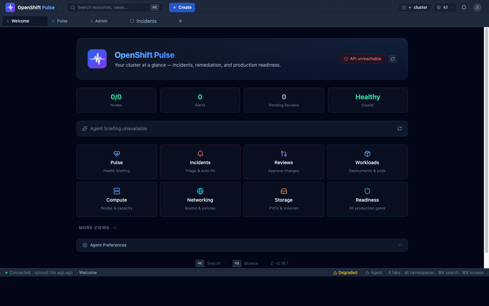 | 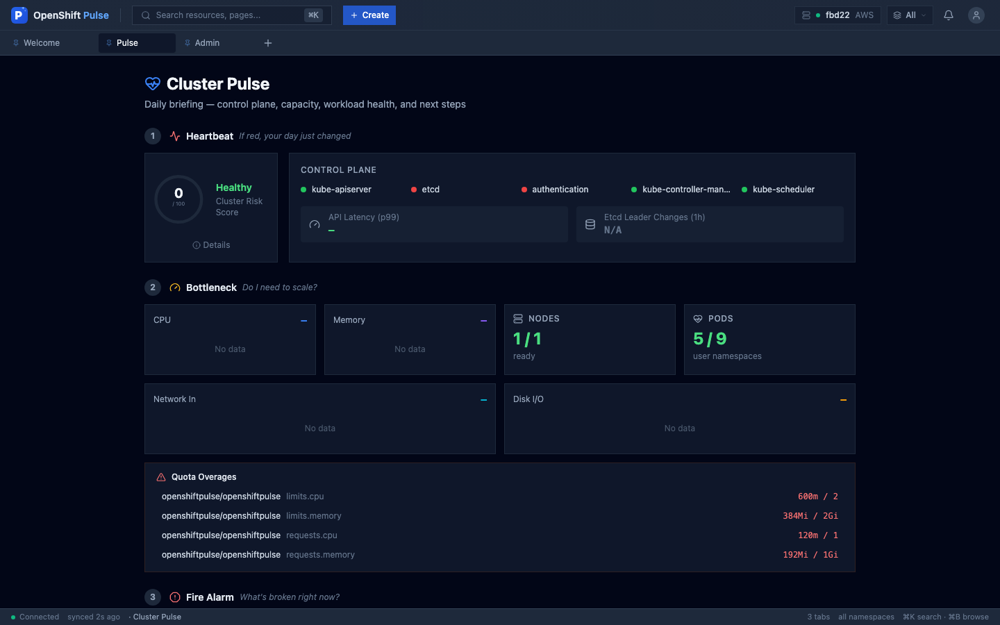 |
| **Welcome** — Quick navigation, cluster status | **Pulse** — Daily briefing, risk score, alerts |
| 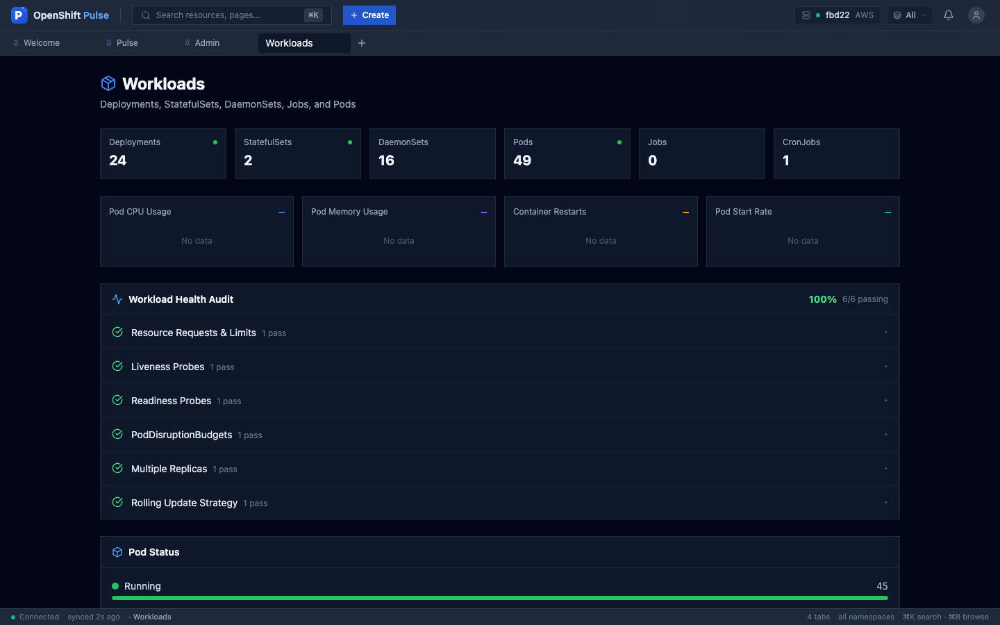 | 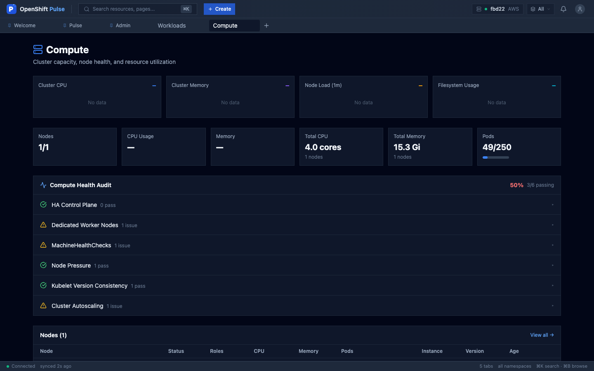 |
| **Workloads** — Deployments, pods, health audit | **Compute** — Node metrics, CPU/memory |
| 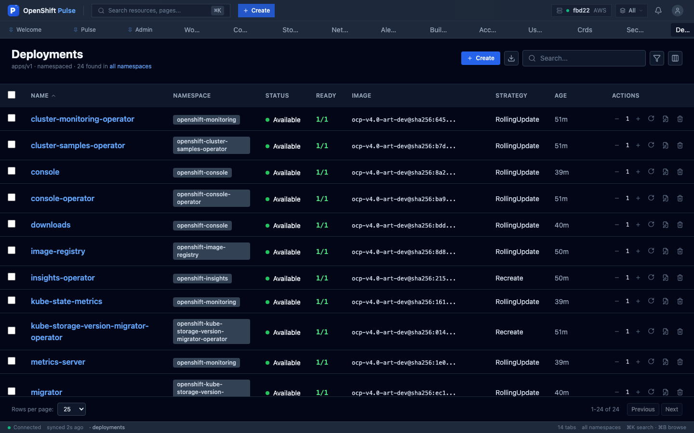 |  |
| **Resource Tables** — Auto-generated, sortable | **YAML Editor** — Autocomplete, snippets, diff |
| 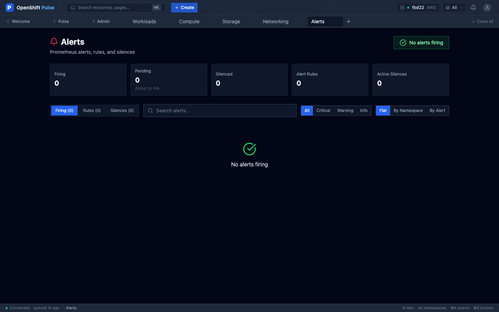 | 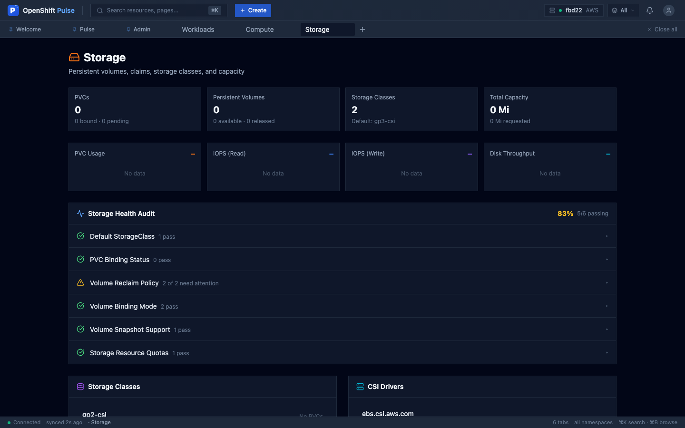 |
| **Alerts** — Severity filters, silence management | **Storage** — PVC health, capacity audit |
| 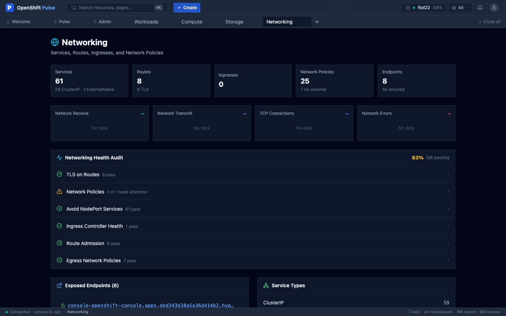 | 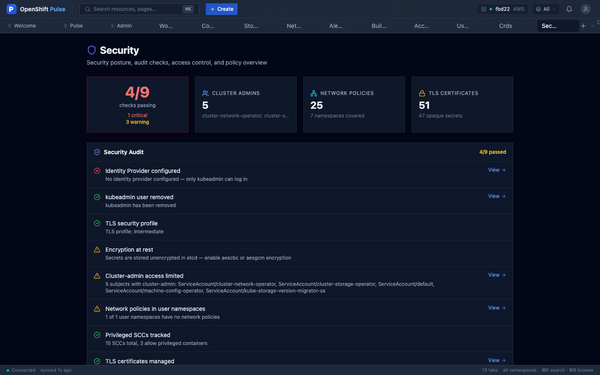 |
| **Networking** — Routes, policies, health audit | **Security** — Policy status, ACS detection |
| 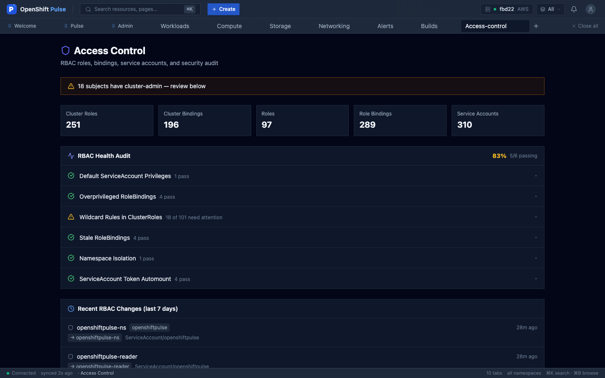 | 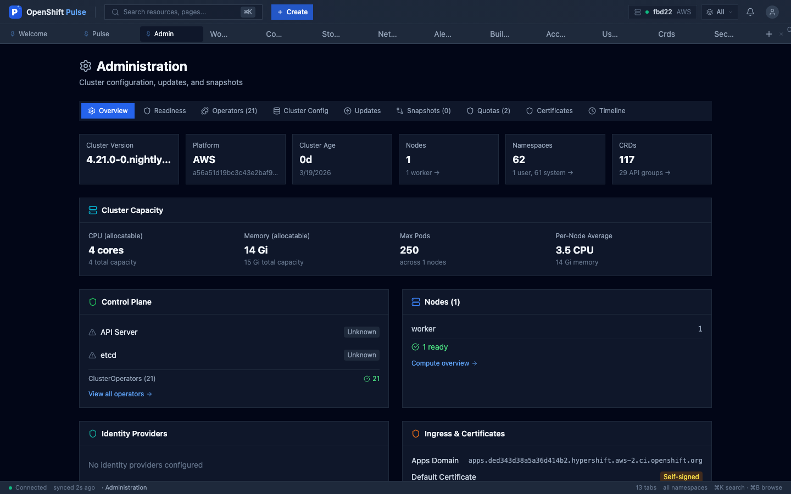 |
| **Access Control** — RBAC audit, cluster-admin review | **Admin** — Operators, config, updates, quotas |

</details>

---

## Features

### At a Glance

| Category | What You Get |
|----------|-------------|
| **AI Agent** | Claude-powered SRE diagnostics and security scanning. 122 tools (86 native + 36 MCP), 7 skills (sre, security, view_designer, capacity_planner, plan_builder, postmortem, slo_management), 73 PromQL recipes, 10 runbooks, ORCA multi-signal routing (6-channel skill selector), dynamic UI rendering (19 component types), dashboard generation with semantic layout engine and auto-save to PostgreSQL, prompt caching, dynamic tool selection, cluster context injection, intelligence loop for continuous improvement. Follow-up suggestions after each response, welcome message on first connect. [pulse-agent](https://github.com/alimobrem/pulse-agent) |
| **Predictive AI** | Live cluster-aware smart prompts: AI suggestions reflect actual issues (crash-looping pods, degraded operators, pending PVCs) not generic templates. Integrated into Command Palette (`?` mode), dock agent panel, and empty states. |
| **Native AI Layer** | Unified intelligence layer across all surfaces: smart prompts adapt to cluster state, AI query mode in Command Palette (`?`), violet-branded AI surfaces, auto-expanding InlineAgent for unhealthy resources, "Ask AI" buttons on PulseView attention items, first-run onboarding, dock notification dot for background insights |
| **Ask Pulse** | Natural language queries in Cmd+K — type a question, get AI-powered answers with action buttons. Dedicated WebSocket, falls back gracefully when agent is offline. |
| **Review Queue** | GitHub-PR-style view of AI-proposed infrastructure changes with YAML diffs, risk badges, and approve/reject actions. Now merged into Incident Center Actions tab. |
| **Enhanced Pulse** | AI morning briefing card, overnight agent activity feed, incident-driven insights rail, cost trend sparkline. All backed by real cluster data. |
| **Ambient AI** | AI insights on every resource detail view, inline "Ask about this" agent, natural language table filters, dock agent panel, proactive background notifications, fleet-wide AI analysis |
| **Error Intelligence** | Structured PulseError classification (7 categories), actionable suggestions on every error toast, "Ask AI" button for agent-assisted diagnosis, error tracking store with persistence |
| **Multi-Cluster Fleet** | Fleet dashboard with health scores, cluster switcher (`Cmd+Shift+C`), cross-cluster search, compliance matrix, certificate heat map, RBAC comparison, config drift detection. Auto-detects ACM/MCE managed clusters. |
| **Cluster Health** | 77 automated checks (31 cluster + 46 domain) with YAML fix examples and "Why it matters" explanations. Actionable metrics: OOMKilled, CrashLoopBackOff, Pending pods, CPU throttling, Nodes Not Ready, API latency/error rate, etcd health. HyperShift-aware — hides control plane metrics unavailable on hosted clusters. |
| **Daily Briefing** | Risk score ring, control plane status, certificate expiry, attention items with remediation steps. "Cluster Zen" calm state when everything is healthy. |
| **Instant Navigation** | Hover-prefetch preloads view data before click — navigation feels instant with zero skeleton flash. Applied to Welcome tiles and Command Palette. |
| **Incident Center** | Consolidates Monitor + Alerts + Errors + Review Queue into 5 tabs: Now (live findings), Investigate (alerts + errors + AI root-cause investigation reports), Actions (merged Review Queue + auto-fix history + post-fix verification), History (correlated timeline), Alerts (severity filters, silence lifecycle). Trust controls are backend-capability-aware. |
| **Identity & Access** | Unified view merging User Management + Access Control into a single surface for users, groups, service accounts, RBAC audit, and impersonation |
| **Incident Timeline** | Unified timeline merging alerts, events, rollouts, and config changes with correlation groups |
| **Admin Overview** | Firing alerts, named degraded operators, cert warnings, quota hot spots, health score, and Agent quality gate status with PASS/FAIL emphasis — the 8am view |
| **ArgoCD / GitOps** | 4-step setup wizard (operator install → git config → first app → verify), sync badges, auto-PR on save, drift detection, Rollouts (canary/blue-green), Projects. GitHub, GitLab, Bitbucket. |
| **Capacity Planning** | predict_linear() projections for CPU, memory, disk, pods with days-until-exhaustion and trend charts |
| **HyperShift** | Auto-detects hosted control planes via infrastructure API. Cluster type badge, dedicated ClusterTypeSummary (NodePool counts vs master/etcd health), role-filtered hex map, adapted capacity planning queries, section ordering tuned per cluster type |
| **Production Readiness Program** | 30 gates across 6 categories (infrastructure, security, observability, reliability, operations, compliance). Wizard + checklist modes, blocking gates, waiver workflow, continuous re-checks on schedule |
| **Degraded Mode UX** | Standardized failure handling across all views — graceful degradation with inline error states, retry actions, and partial data rendering when APIs are unavailable |
| **Trust Escalation** | Confirmation dialog for agent trust level 3/4 escalation, preventing accidental grant of destructive capabilities |
| **Version History** | Custom view version history panel — browse, compare, and restore previous versions of agent-generated views |
| **Live Chart Refresh** | Charts auto-refresh with Live/Paused toggle indicator. Visual feedback for real-time vs. static data |
| **Custom Dashboards** | AI-generated views with 73 PromQL recipes, semantic auto-layout engine, view validator (dedup, schema, title quality), quality critic (0-10 scoring). Plan → Build → Critique → Present workflow. Clone, delete, version history, share. User-scoped with owner-based access control |
| **Tool Analytics** | Full tool call audit log (PostgreSQL), tool chain discovery (bigram analysis), usage stats API, token tracking per turn. Tools page with catalog, usage log, and analytics tabs — includes unused tools coverage chart for prompt optimization |
| **Feature Flags** | localStorage-based feature flag system with toggle UI in Admin. Gate unreleased features, A/B test surfaces, disable features without redeployment |
| **Security** | 10 audit checks incl. ACS/StackRox detection, HyperShift-adapted. [Full details](SECURITY.md) |

### Operations

| Feature | Details |
|---------|---------|
| **AI Agent** | Chat with Claude-powered SRE/Security agent (122 tools, 7 skills, 73 PromQL recipes, 19 component types). "Ask Agent" from any resource. Streaming, tool execution indicators, confirmation gates. Follow-up suggestions after each response, welcome message on first connect, capability change toast notifications. Mission Control at `/agent` with Trust Policy, Agent Health, Agent Accuracy, and Capability Discovery sections. |
| **Ask Pulse** | Natural language queries in Cmd+K: type a question in the Command Palette, get AI-powered answers with action buttons. "Open in Agent" for full conversations. |
| **Incident Actions** | PR-style review of AI-proposed changes merged into Incident Center: YAML diffs, risk badges, business impact, approve/reject. Live data from monitor WebSocket. |
| **Native AI UX** | Unified violet-branded intelligence layer: `?` in Command Palette sends to agent, smart prompts adapt to cluster state, "Ask AI" on PulseView attention items, auto-expand InlineAgent for unhealthy resources, AI empty state suggestions, first-run onboarding card, dock agent notification dot. |
| **Ambient AI** | AmbientInsight cards on pod/workload detail views. InlineAgent scoped conversations on every resource. NL table filters via AI-branded button. Agent dock panel accessible from any view. Background proactive notifications every 5 min. |
| **Rich Confirmations** | Visual confirmation cards with risk badges (LOW/MEDIUM/HIGH), impact preview, rollback info, keyboard shortcuts (Y/N/Esc). |
| **Deployment Rollback** | Revision history with container image diffs, one-click rollback |
| **Pod/Node Terminal** | WebSocket exec with command history, copy output, GitHub-dark theme |
| **Cluster Snapshots** | Capture state, compare field-by-field to find what changed |
| **Dry-Run Validation** | Server-side dry-run before applying YAML changes |
| **RBAC-Aware UI** | Actions disabled with explanatory tooltips based on SelfSubjectAccessReview |
| **User Impersonation** | Test as any user/SA — headers on all API calls, amber banner |
| **Real-time Watches** | WebSocket + 60s polling fallback via TanStack Query |

### Developer Experience

| Feature | Details |
|---------|---------|
| **YAML Editor** | CodeMirror with K8s autocomplete, schema panel, 71 snippets, inline diff |
| **Resource Creation** | 5 modes: Quick Deploy, Templates (30), Helm, Import YAML, Operators |
| **Operator Catalog** | 500+ operators, one-click install, 4-step progress tracking |
| **Smart Diagnosis** | 10 error patterns from pod logs with specific fix suggestions |
| **Auto-Generated Tables** | Sortable, searchable, j/k navigation, CSV/JSON export |

### Views (18 routable + 5 merged)

| View | Highlights |
|------|-----------|
| **Welcome** | Quick nav, cluster status with error recovery, all capabilities clickable, keyboard shortcuts |
| **Pulse** | AI morning briefing, overnight agent activity feed, incident insights rail, cost trends. "Cluster Zen" calm state when healthy. Fleet mode: cluster health table, risk scores, AI analysis |
| **Agent** | Mission Control at `/agent` — Trust Policy, Agent Health, Agent Accuracy, and Capability Discovery |
| **Workloads** | Metrics + 6-check health audit, deployments sorted unhealthy-first |
| **Compute** | Node hex map with role filters, cluster type summary (HyperShift vs self-managed), capacity planning, machine management |
| **Storage** | PVC health, capacity audit, CSI drivers |
| **Networking** | Routes, network policies, ingress health |
| **Alerts** | Now a tab in Incident Center — severity filters, silence lifecycle |
| **Builds** | Now a tab in Workloads — BuildConfigs, ImageStreams, one-click trigger |
| **Access Control** | Now merged into Identity — RBAC audit (6 checks), recent changes |
| **User Management** | Now merged into Identity — Users/groups/SAs, impersonation, identity audit |
| **CRDs** | Now a tab in Admin — browse by API group, search, filter |
| **Security** | 10 checks, SCC audit, ACS detection |
| **GitOps** | 4-step setup wizard, ArgoCD Applications, sync history, drift, Rollouts (canary/blue-green), Projects |
| **Identity** | Unified view merging Users, Groups, Service Accounts, RBAC audit, and impersonation at `/identity` |
| **Incidents** | 5 tabs: Now (live findings), Investigate (alerts + errors + AI investigation), Actions (review queue + auto-fix), History (correlated timeline), Alerts |
| **Readiness** | Production readiness program — 30 gates across 6 categories, wizard + checklist modes, waiver workflow |
| **Fleet** | Multi-cluster dashboard, cross-cluster search, comparison, compliance, cert heat map |
| **Custom Views** | AI-generated dashboards at `/custom/:viewId`. Agent creates views via `create_dashboard` tool with metric cards, charts, and tables. Semantic auto-layout, version history, clone, delete, share. Plan → Build → Critique workflow |
| **Toolbox** | Consolidated tools hub at `/toolbox` — 8 tabs: Catalog (all 122 tools with native/MCP source badges), Skills (7 skill packages with status and routing config), Plans (plan templates and active executions), SLOs (SLO registry with burn rates), Connections (MCP server management with toolset toggles), Components (19 component kinds with mutation support), Usage (tool invocation audit log), Analytics (routing accuracy, fix strategies, agent learning) |
| **Project** | Namespace-scoped dashboard at `/project/:namespace` with resource summary and health overview |
| **Claim** | Share token claim view at `/share/:shareToken` for accepting shared custom views |
| **Admin** | 8 tabs: Overview, Operators, Config, Updates, Snapshots, Quotas, Certificates, CRDs |

---

## Tech Stack

| | Technology | Why |
|---|-----------|-----|
| **Framework** | React 19 + TypeScript 5.9 | Type-safe, 50+ K8s interfaces |
| **Bundler** | Rspack 1.7 | Rust-based, ~1s production builds |
| **State** | Zustand + TanStack Query | Client + server state separation |
| **Real-time** | WebSocket watches | Instant updates, 60s polling fallback |
| **Styling** | Tailwind CSS 3.4 + Radix UI | Utility-first, headless components, CVA variants |
| **Testing** | Vitest + Playwright + Helm | 1,908 unit + 13 Helm + 53 E2E in ~9s |
| **Charts** | recharts + SVG sparklines | Rich charts with lightweight inline sparklines |
| **Security** | Red Hat UBI images | 0 CVEs, all images from Red Hat registries |

---

## Deploy to OpenShift

> **Requires `cluster-admin`** — creates ClusterRole, ClusterRoleBinding, OAuthClient.

### One-Command Deploy (UI + Agent)

```bash
# Option A: Vertex AI (GCP)
ANTHROPIC_VERTEX_PROJECT_ID=your-project CLOUD_ML_REGION=us-east5 \
  ./deploy/deploy.sh --gcp-key ~/sa-key.json

# Option B: Anthropic API (no GCP needed)
ANTHROPIC_API_KEY=sk-ant-... ./deploy/deploy.sh

# Verify
./deploy/integration-test.sh
```

**How it works**: Uses an **umbrella Helm chart** (`deploy/helm/pulse/`) that deploys both UI and agent as subcharts in a single `helm upgrade --install --atomic`. The deploy script auto-detects the agent repo (looks for `../pulse-agent` by default). Builds images locally with Podman, pushes to Quay.io, deploys atomically with auto-rollback on failure. A values file replaces 20+ `--set` flags. Never uses S2I or on-cluster builds.

**Deploy tracking**: Every deploy records duration timing and writes to a local history log (`~/.pulse-deploy-history.jsonl`). A ConfigMap with deploy metadata is written to the cluster. Optional `--slack-webhook` sends notifications on success/failure.

**Startup probes**: All 4 containers (oauth-proxy, nginx, agent, postgresql) have startup probes for reliable rollout detection.

**Self-monitoring**: A ServiceMonitor and 4 PrometheusRules (UIDown, AgentDown, AgentHighRestarts, PostgreSQLDown) are deployed by default.

**Rollback**: `--rollback` flag reverts to the previous Helm release. Failed health checks trigger automatic rollback.

**Session persistence**: OAuth cookie (168h TTL) and client secrets are generated once and persisted in-cluster. Subsequent `helm upgrade` runs reuse existing secrets via `lookup()`, so users are never logged out on redeploy.

**WS token**: Stored as a Kubernetes Secret (not ConfigMap). The umbrella chart owns the shared WS token secret. Both the agent (via `secretKeyRef`) and the UI nginx proxy (via Helm `lookup()`) reference the same secret. No manual token management.

**Build context**: `.dockerignore` reduces frontend build context from ~500MB to ~5MB.

**Other features**: `--dry-run` to preview, `--uninstall` to clean up, `--rollback` to revert. Images tagged with git SHA for rollback safety. Proxy chain health check validates connectivity end-to-end.

**Prerequisites**: `oc` (logged in), `helm`, `pnpm`, `podman` (logged in to your registry).

### Helm Charts

| Chart | Path | Description |
|-------|------|-------------|
| **pulse** (umbrella) | `deploy/helm/pulse/` | Single install for UI + Agent |
| openshiftpulse | `deploy/helm/openshiftpulse/` | UI only (standalone) |
| openshift-sre-agent | `pulse-agent/chart/` | Agent only (standalone) |

### Quick Redeploy

```bash
# UI only (skip agent rebuild)
pnpm build && podman build --platform linux/amd64 -t ${PULSE_UI_IMAGE:-quay.io/your-org/openshiftpulse}:latest . \
  && podman push ${PULSE_UI_IMAGE:-quay.io/your-org/openshiftpulse}:latest \
  && oc rollout restart deployment/openshiftpulse -n openshiftpulse

# Config-only change (no rebuild)
./deploy/deploy.sh --rollback
```

### Uninstall

```bash
./deploy/deploy.sh --uninstall
```

### Security

OAuth proxy with per-user auth. Non-root containers, read-only filesystem, CSP headers, TLS verification. 15/15 audit findings resolved. 0 npm CVEs. All images from Red Hat registries. Secret rotation procedures documented. See **[SECURITY.md](SECURITY.md)** for full details.

<details>
<summary><strong>Troubleshooting</strong></summary>

| Problem | Fix |
|---------|-----|
| 503 on login | Delete TLS secret, re-add `serving-cert-secret-name` annotation |
| 403 on API calls | OAuthClient needs `user:full` in `scopeRestrictions` |
| oauth-proxy crash (tokenreviews) | ClusterRole needs tokenreviews/subjectaccessreviews — re-apply manifests |
| cookie_secret error | Regenerate with `openssl rand -hex 16` (not base64) |
| Metrics blank (SSL error) | Use `service-ca.crt` (not `ca.crt`) for Prometheus/Alertmanager |
| Build stuck | Check configmap quota (`oc get resourcequota`) — need headroom (set >=50) |
| Pods not scheduling | Need 2+ nodes for topology spread constraints |

</details>

---

## Development

```bash
pnpm install         # Install dependencies
cp .env.example .env # Configure cluster URLs (optional)
oc proxy --port=8001 & # Start API proxy
pnpm dev             # Dev server on port 9000
pnpm test            # Run test suite (1908 tests)
pnpm build           # Production build (~1s)
pnpm type-check      # TypeScript checking
pnpm verify          # Full check: types + lint + test + build
```

| Variable | Default | Description |
|----------|---------|-------------|
| `K8S_API_URL` | `http://localhost:8001` | K8s API proxy target |
| `THANOS_URL` | *(disabled)* | Thanos Querier for Prometheus metrics |
| `ALERTMANAGER_URL` | *(disabled)* | Alertmanager for alert management |
| `PULSE_AGENT_URL` | `http://localhost:8080` | Pulse Agent API server for AI diagnostics |

---

## Architecture

```
src/kubeview/
├── engine/              # Query, discovery, watch, snapshot, timeline
│   └── types/           # 50+ typed K8s interfaces
├── views/               # 18 views + admin tabs
│   └── admin/           # Overview, Operators, Updates, Snapshots, Quotas, Certificates, CRDs
├── components/          # Design system primitives, feedback, YAML editor, Terminal, Dock
│   ├── primitives/      # Button, Card, Badge, Tabs, Input, Tooltip, DataTable, StatCard, SectionHeader
│   ├── feedback/        # Toast, ConfirmDialog, ProgressModal, InlineFeedback
│   └── agent/           # MessageBubble, InlineAgent, AmbientInsight, ConfirmationCard, NLFilterBar, DockAgentPanel
├── hooks/               # useK8sListWatch, useCanI, useSmartPrompts, usePrefetchOnHover
├── store/               # Zustand (UI, cluster, fleet, agent state)
└── App.tsx              # Shell + routes (~45 lines)
```

```
Browser --> OAuth Proxy (8443/TLS) --> nginx (8080) --> K8s API / Prometheus / Alertmanager
                  |                                  \
          User's OAuth token forwarded               --> Pulse Agent (8080/WS) --> Claude API + K8s API
```

## Keyboard Shortcuts

| Shortcut | Action |
|----------|--------|
| `Cmd+K` | Command Palette |
| `Cmd+B` | Resource Browser |
| `Cmd+J` | Toggle Dock |
| `Cmd+.` | Quick Actions |
| `j / k` | Navigate table rows |
| `Esc` | Close overlays |

---

<p align="center">
  <strong>1,908 unit + 13 Helm + 53 E2E tests</strong> &bull; <strong>77 health checks</strong> &bull; <strong>~1s builds</strong> &bull; <strong>0 CVEs</strong> &bull; <strong>18 views</strong> &bull; <strong>122 AI tools</strong> &bull; <strong>7 skills</strong> &bull; <strong>500+ operators</strong>
</p>

<p align="center">
  <a href="https://github.com/alimobrem/OpenshiftPulse/releases">Releases</a> &bull;
  <a href="SECURITY.md">Security</a> &bull;
  <a href="CHANGELOG.md">Changelog</a> &bull;
  <a href="https://github.com/alimobrem/OpenshiftPulse/issues">Issues</a>
</p>

<p align="center">MIT License</p>
