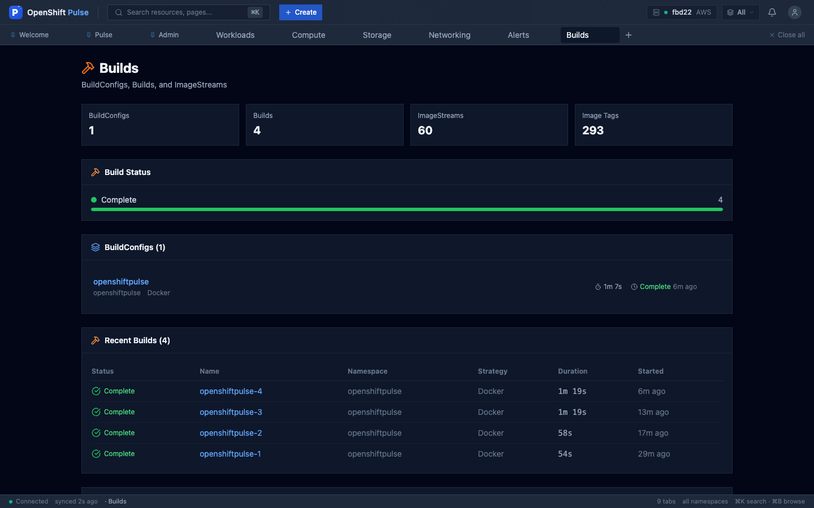
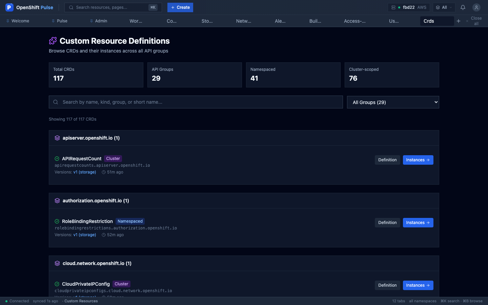
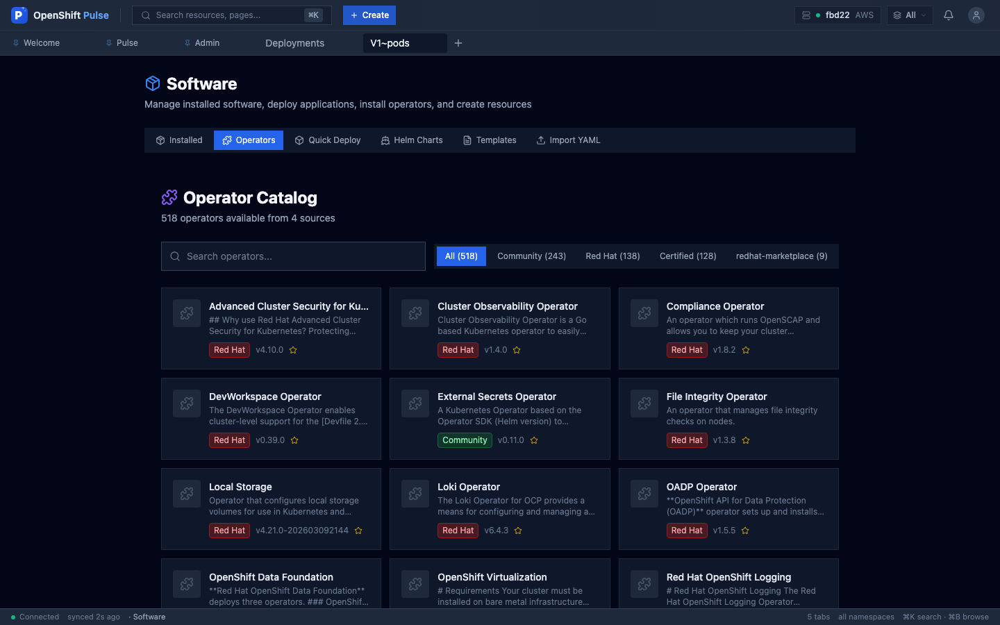
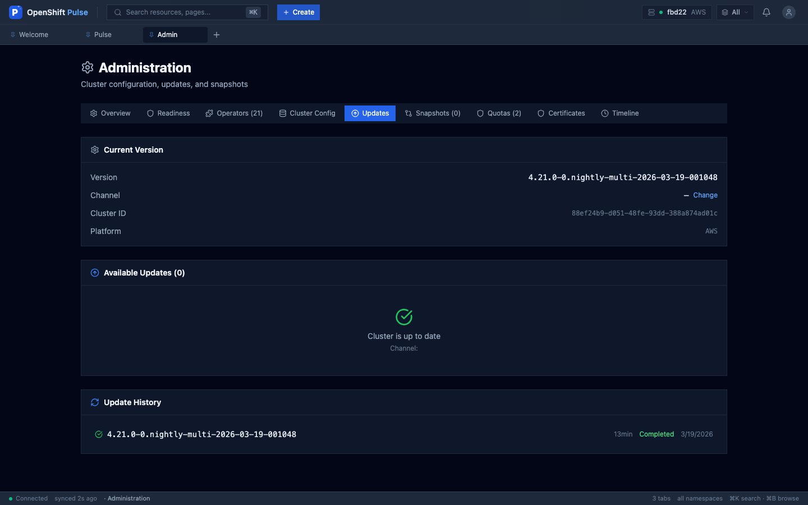

<p align="center">
  
</p>

<h1 align="center">OpenShift Pulse</h1>

<p align="center">
  <strong>Next-generation OpenShift Console for Day-2 Operations</strong>
</p>

<p align="center">
  <a href="https://github.com/alimobrem/OpenshiftPulse/releases/tag/v4.0.0"></a>
  
  
  
  
  
</p>

<p align="center">
  <em>Scored <strong>93/100</strong> by a Senior SysAdmin reviewer — "primary tool for single-cluster day-2 operations."</em>
</p>

---

Built with React, TypeScript, and real-time Kubernetes APIs. Every view is auto-generated from the API — browse any resource type, see what needs attention, and take action in seconds. Deployed with OAuth proxy for multi-user authentication.

## Screenshots

| | |
|---|---|
|  |  |
| **Welcome** — Quick navigation, cluster status | **Pulse** — Health overview, metrics, alerts |
|  |  |
| **Workloads** — Deployments, pods, health audit | **Compute** — Node metrics, CPU/memory |
|  |  |
| **Resource Tables** — Auto-generated, sortable | **YAML Editor** — Autocomplete, snippets, diff |
|  |  |
| **Alerts** — Severity filters, silence management | **Storage** — PVC health, capacity audit |
|  |  |
| **Networking** — Routes, policies, health audit | **Security** — Policy status, vulnerability context |
|  |  |
| **Access Control** — RBAC audit, cluster-admin review | **Admin** — Readiness, config, updates, snapshots |
|  |  |
| **Builds** — BuildConfigs, ImageStreams | **CRDs** — Browse by API group, instances |
|  |  |
| **Operator Catalog** — One-click install | **Cluster Updates** — Pre-checks, operator progress |

## Highlights

| | Feature | Details |
|---|---------|---------|
| | **67 Health Checks** | Automated cluster readiness + domain-specific audits with YAML fix examples |
| | **Incident Context** | Events, logs (container picker), and metrics inline on detail views |
| | **Pod/Node Debug** | Ephemeral containers for pods, privileged debug pods for nodes |
| | **RBAC-Aware UI** | Actions hidden/disabled based on SelfSubjectAccessReview |
| | **User Impersonation** | Test as any user or service account — headers on all API calls |
| | **Real-time Watches** | WebSocket watches with 60s safety-net polling via TanStack Query |
| | **Security Hardened** | Passed 15-finding security audit — injection, SSRF, TLS, CSP, RBAC |
| | **1128 Tests** | 61 test files, 100% passing, ~3 seconds |

## Views

| View | Description |
|------|-------------|
| **Welcome** | Hero, cluster status, quick nav, start-here cards, all views grid, key capabilities, keyboard shortcuts |
| **Pulse** | Cluster health overview with 4 tabs: Overview, Issues, Runbooks, Namespace Health |
| **Workloads** | Metrics, health audit (6 checks), pod status, deployments, jobs |
| **Builds** | BuildConfigs with trigger buttons, build status/duration, ImageStreams with tags |
| **Networking** | Metrics, health audit (6 checks), endpoints, ingress, network policies |
| **Compute** | Metrics, health audit (6 checks), nodes with CPU/memory bars, MachineConfig |
| **Storage** | Metrics, health audit (6 checks), capacity, CSI drivers, snapshots |
| **Alerts** | Severity filters, grouping, duration, silence lifecycle, runbooks |
| **Access Control** | RBAC audit (6 checks), recent RBAC changes (7 days) |
| **User Management** | Users/groups/SAs, impersonation, identity audit (6 checks), sessions |
| **CRDs** | Browse by API group, search, filter, instance navigation |
| **Security** | Security overview, policy status, vulnerability context |
| **Admin** | 9 tabs: Readiness (31 checks), Cluster Config (10 editable sections), Updates, Certificates, Snapshots, Quotas, Timeline |

## Features

### Health Audits (36 Domain Checks + 31 Cluster Checks = 67 Total)
Each overview view has an expandable audit with score %, per-resource pass/fail, "Why it matters" explanations, YAML fix examples, and direct "Edit YAML" links.

- **Workloads (6)**: Resource limits, liveness probes, readiness probes, PDBs, replicas, rolling update strategy
- **Storage (6)**: Default StorageClass, PVC binding, reclaim policy, WaitForFirstConsumer, volume snapshots, storage quotas
- **Networking (6)**: Route TLS, network policies, NodePort avoidance, ingress controller health, route admission, egress policies
- **Compute (6)**: HA control plane, dedicated workers, MachineHealthChecks, node pressure, kubelet version consistency, cluster autoscaling
- **Access Control (6)**: Default SA privileges, overprivileged bindings, wildcard rules, stale bindings, namespace isolation, automount tokens
- **Identity (6)**: Identity providers, kubeadmin removal, cluster-admin audit, SA privileges, inactive users, group membership

### Workload Health on Detail Views
Every Deployment, StatefulSet, and DaemonSet detail view shows per-container health checks: resource limits, resource requests, liveness probes, readiness probes, HA replicas, update strategy, and security context (runAsNonRoot, privilege escalation, capabilities). Expandable rows show probe descriptions.

### Builds
BuildConfigs with one-click trigger, average build duration, last build status. Builds table with status, strategy, duration, timestamps. In-progress and failed builds panels. ImageStreams with tag badges.

### Cluster Config (10 Editable Sections)
OAuth, Proxy, Image, Ingress, Scheduler, API Server (full editors). DNS (warning: breaks routing), Network (warning: cluster disruption), FeatureGate (warning: irreversible), Console (product name, logo, route, statuspage).

### Cluster Upgrades
Pre-update checklist (nodes ready, operators healthy, channel, etcd backup, PDBs), ClusterVersion conditions (Progressing/Failing banners), version skip indicators, risk badges, duration estimates, per-operator update progress during rolling upgrade, history with duration.

### Operator Catalog & Lifecycle
Browse 500+ operators. One-click install with 4-step progress tracking. Post-install guidance for 9+ operators. Full uninstall flow. Channel selector, namespace auto-suggestion. Helm install with validated release names and `--repo` flag (no shell injection).

### Alerts & Silence Management
Severity filters (Critical/Warning/Info), group by namespace or alertname, firing duration display, silenced indicators, runbook links, silence creation from any alert, silence expiration with confirmation.

### User Management & Impersonation
Users, groups, service accounts with role bindings. One-click impersonation — all API requests include `Impersonate-User` headers (CRLF-sanitized). Amber banner shows active impersonation across all views.

### Auto-Generated Resource Tables
Every resource type gets sortable columns, search, per-column filters, bulk delete, keyboard navigation (j/k), CSV/JSON export, Edit YAML + Delete on every row, and inline scale controls for deployments.

### Smart Diagnosis with Log Analysis
10 error patterns detected from pod logs: Permission denied, Connection refused, OOM, DNS failure, read-only filesystem, wrong architecture — each with specific fix suggestions.

### YAML Editor
CodeMirror with K8s autocomplete, YAML linting, Schema panel (from CRD OpenAPI), 71 context-aware sub-snippets (insert at cursor), 30 full resource templates, inline diff view, keyboard shortcuts help. Impersonation headers included on all save operations.

## Tech Stack

| Layer | Technology |
|-------|-----------|
| **Framework** | React 19 + TypeScript 5.9 |
| **Bundler** | Rspack 1.7 (Rust-based, ~1s builds) |
| **State** | Zustand (client) + TanStack Query (server) |
| **Real-time** | WebSocket watches + 60s polling fallback |
| **Styling** | Tailwind CSS 3.4 |
| **Testing** | Vitest + jsdom (1128 tests) |
| **Icons** | Lucide React (icon registry, ~50 icons) |
| **Charts** | Pure SVG sparklines (no chart library) |

## Getting Started

```bash
# Install dependencies
npm install

# Log in to your cluster
oc login --server=https://api.your-cluster.example.com:6443

# Start the API proxy
oc proxy --port=8001 &

# Copy the env example and configure for your cluster
# (optional — needed for Prometheus/Alertmanager proxying in dev)
cp .env.example .env
# Edit .env with your cluster's Thanos and Alertmanager route URLs

# Start the dev server (port 9000)
npm run dev
```

Open http://localhost:9000. Clear `openshiftpulse-ui-storage` from localStorage on first run to get default pinned tabs.

### Environment Variables

| Variable | Required | Default | Description |
|----------|----------|---------|-------------|
| `K8S_API_URL` | No | `http://localhost:8001` | K8s API proxy target (via `oc proxy`) |
| `THANOS_URL` | No | *(disabled)* | Thanos Querier route URL for Prometheus proxy |
| `ALERTMANAGER_URL` | No | *(disabled)* | Alertmanager route URL |
| `CONSOLE_URL` | No | *(auto-detected)* | OpenShift Console URL for Helm API proxy |
| `OC_TOKEN` | No | *(auto-detected)* | Override for `oc whoami -t` token |

## Deploy to OpenShift

### First-time setup

```bash
# Log in to your cluster
oc login --server=https://api.your-cluster.example.com:6443

# Generate OAuth secrets
# - Client secret: any length, used for OAuthClient authentication
# - Cookie secret: must be exactly 16, 24, or 32 bytes for AES (required when pass_access_token=true)
CLIENT_SECRET=$(openssl rand -base64 32 | tr -d '\n')
COOKIE_SECRET=$(openssl rand -hex 16)  # 32 hex chars = 16 bytes

# Create namespace and secrets
oc create namespace openshiftpulse
oc create secret generic openshiftpulse-oauth-secrets \
  --from-literal=client-secret="$CLIENT_SECRET" \
  --from-literal=cookie-secret="$COOKIE_SECRET" \
  -n openshiftpulse

# Apply deployment manifests (creates ServiceAccount, RBAC, OAuthClient,
# ConfigMap, Deployment, PDB, ResourceQuota, LimitRange, Service, Route)
oc apply -f deploy/deployment.yaml

# Patch the OAuthClient with the generated client secret
oc patch oauthclient openshiftpulse \
  -p "{\"secret\":\"$CLIENT_SECRET\"}"

# Create a BuildConfig for binary builds
oc new-build --binary --name=openshiftpulse --to=openshiftpulse:latest -n openshiftpulse

# Build and deploy
npm run build
oc start-build openshiftpulse --from-dir=. --follow -n openshiftpulse

# Update the OAuthClient redirectURI to match your cluster's route
ROUTE=$(oc get route openshiftpulse -n openshiftpulse -o jsonpath='{.spec.host}')
oc patch oauthclient openshiftpulse --type merge \
  -p "{\"redirectURIs\":[\"https://${ROUTE}/oauth/callback\"]}"

# Restart to pick up the new image
oc rollout restart deployment/openshiftpulse -n openshiftpulse
```

### Quick redeploy (one-liner)

```bash
npm run build && oc start-build openshiftpulse --from-dir=. --follow -n openshiftpulse && oc rollout restart deployment/openshiftpulse -n openshiftpulse
```

### Security Model

| Layer | Mechanism |
|-------|-----------|
| **User authentication** | OAuth proxy sidecar with OAuthClient (`user:full` scope — required for write operations) |
| **User authorization** | User's OAuth token forwarded via `X-Forwarded-Access-Token` header to K8s API |
| **Service account** | Minimal ClusterRole (`openshiftpulse-reader`) with read-only access + token review for OAuth proxy |
| **Secrets** | OAuth client secret and cookie secret mounted from a K8s Secret via files (`--client-secret-file`, `--cookie-secret-file`) |
| **Container security** | `runAsNonRoot`, `readOnlyRootFilesystem`, drop ALL capabilities, seccomp RuntimeDefault |
| **TLS verification** | `proxy_ssl_verify on` with `ca.crt` for K8s API, `service-ca.crt` for Prometheus/Alertmanager |
| **HTTP headers** | CSP (`default-src 'self'`), X-Frame-Options DENY, HSTS, X-Content-Type-Options nosniff, Referrer-Policy |
| **Input validation** | Helm release names validated (`^[a-z0-9][a-z0-9-]{0,52}$`), PromQL sanitized, CRLF stripped from impersonation headers, regex escaped in log search |
| **SSRF protection** | Dev proxy validates URL protocol, blocks private/internal IPs |
| **Resource limits** | ResourceQuota (10 pods, 1 CPU, 1Gi memory) and LimitRange (per-container defaults and maximums) |

### Security Audit Results

A comprehensive security audit was performed covering authentication, injection vulnerabilities, sensitive data exposure, API security, deployment security, and client-side security. All 15 findings (1 critical, 4 high, 7 medium, 3 low) have been resolved:

| Severity | Finding | Resolution |
|----------|---------|------------|
| Critical | Helm command injection via `sh -c` | Validate release names, use array args with `--repo` flag |
| High | SSRF in dev proxy | Validate URL protocol, block private/link-local IPs |
| High | Impersonation CRLF injection | Strip `\r\n` from all impersonation header values |
| High | Missing nginx security headers | Added CSP, X-Frame-Options, HSTS, nosniff, Referrer-Policy |
| High | `proxy_ssl_verify off` | Enabled with correct CA certs (`ca.crt` for API, `service-ca.crt` for monitoring) |
| Medium | Prometheus label path injection | Validate label names against `^[a-zA-Z_][a-zA-Z0-9_]*$` |
| Medium | Path traversal in `buildApiPathFromResource` | Apply `sanitizePathSegment` to namespace and name |
| Medium | Node log file path traversal | Validate filenames against `^[a-zA-Z0-9._-]+$` |
| Medium | RegExp DoS in log search | Escape regex special chars before `new RegExp()` |
| Medium | Missing `readOnlyRootFilesystem` | Added to both containers with emptyDir for writable paths |
| Medium | Placeholder secrets in manifest | Documented generation steps, added deployment validation |
| Medium | Broad `user:full` OAuth scope | Documented requirement (app performs write operations) |
| Low | Impersonation header format | Fixed to comma-separated `Impersonate-Group`, sanitized CRLF |
| Low | YAML editor missing impersonation | Added `getImpersonationHeaders()` to GET and PUT requests |
| Low | Token logging risk in dev | Documented in `.env.example` |

### What the deployment includes

| Component | Details |
|-----------|---------|
| **OAuth proxy** | Sidecar with explicit OAuthClient, `user:full` scope, per-user authentication |
| **nginx** | Reverse proxy forwarding user's `X-Forwarded-Access-Token` to K8s API, Prometheus, Alertmanager |
| **2 replicas** | PodDisruptionBudget (minAvailable: 1), topology spread across nodes |
| **Zero-downtime** | RollingUpdate with maxUnavailable: 0 |
| **Minimal RBAC** | Scoped ClusterRole with read-only access + token review — user actions use the user's own token |
| **ResourceQuota** | 10 pods, 1 CPU / 1Gi memory requests, 2 CPU / 2Gi limits, 50 configmaps, 20 secrets |
| **LimitRange** | Default 200m/256Mi per container, max 1 CPU/1Gi |
| **Security hardening** | readOnlyRootFilesystem, CSP headers, TLS verification, non-root containers |

### Troubleshooting

- **503 on login page**: Delete the TLS secret and re-add the `serving-cert-secret-name` annotation on the Service to trigger service-ca regeneration
- **403 on API calls**: Ensure the OAuthClient has `user:full` in `scopeRestrictions` — SA-based OAuth clients cannot use this scope
- **oauth-proxy crash (tokenreviews forbidden)**: The ClusterRole needs `tokenreviews` and `subjectaccessreviews` create permissions — re-apply `deploy/deployment.yaml`
- **oauth-proxy crash (cookie_secret must be 16/24/32 bytes)**: Regenerate cookie secret with `openssl rand -hex 16` (not base64)
- **Metrics blank (SSL certificate verify error)**: Prometheus/Alertmanager use service-ca certs — ensure nginx uses `service-ca.crt` (not `ca.crt`) for those upstreams
- **Build stuck/pending**: Check configmap quota (`oc get resourcequota -n openshiftpulse`) — builds need headroom for temp configmaps (set ≥50)
- **Pods not scheduling**: Check PDB and topology constraints — need ≥2 nodes for topology spread

## Testing

```bash
npm test              # Run all tests
npm run type-check    # TypeScript checking
```

### Test Results

```
 Test Files  61 passed (61)
      Tests  1128 passed (1128)
   Duration  3.00s
```

| Test Area | Files | Tests |
|-----------|-------|-------|
| Views (render + behavior) | 20 | 350+ |
| Engine (query, discovery, diagnosis, watch) | 12 | 200+ |
| Components (CommandPalette, feedback, logs) | 8 | 150+ |
| Hooks (useCanI, useDiscovery, etc.) | 6 | 80+ |
| Store (uiStore, clusterStore) | 3 | 55+ |
| Routes (structure, security, cleanup) | 1 | 28 |
| Security audit (injection, headers, TLS, SSRF) | 1 | 29 |
| Integration (CRUD, delete flow, operators) | 4 | 80+ |

## Architecture

```
src/kubeview/
├── engine/              # Query (with impersonation), discovery, diagnosis, watch manager
├── views/               # 14 view components + health audits + incident context
├── components/          # Shared UI (Panel, ClusterConfig, Sparkline, YamlEditor)
├── hooks/               # useK8sListWatch, useCanI (RBAC), useNavigateTab
├── store/               # Zustand (uiStore with impersonation, clusterStore)
├── routes/              # Route modules (resource, domain, redirects)
│   ├── resourceRoutes.tsx   # GVR wrapper components + resource routes
│   ├── domainRoutes.tsx     # Domain view routes (workloads, networking, etc.)
│   ├── redirects.tsx        # Legacy path redirects
│   └── index.ts             # Barrel export
└── App.tsx              # Shell + composed route children (~45 lines)
```

### Data Flow

```
Browser → OAuth Proxy (8443) → nginx (8080) → K8s API / Prometheus / Alertmanager
                ↓
        User's OAuth token forwarded via X-Forwarded-Access-Token
        (SA token NOT used for API calls — only for pod identity)
```

## Keyboard Shortcuts

| Shortcut | Action |
|----------|--------|
| ⌘K / ⌘. | Command Palette |
| ⌘B | Resource Browser |
| j / k | Navigate table rows |

## Stats

| Metric | Value |
|--------|-------|
| Production files | ~100 |
| Tests | 1128 (100% passing) |
| Test files | 61 |
| Routes | 35 |
| Views | 14 |
| Health checks | 67 (31 cluster + 36 domain) |
| YAML templates | 30 + 71 context-aware snippets |
| Operators in catalog | 500+ |
| Error pattern detections | 10 |
| Security findings resolved | 15/15 |
| Build time | ~1s (Rspack) |
| Test time | ~3s |

---

## Reviews

### SysAdmin Review: 93/100

| Dimension | Score |
|-----------|-------|
| Day-1 Usefulness | 9/10 |
| Incident Response | 9/10 |
| Operational Efficiency | 10/10 |
| Learning & Discovery | 10/10 |
| Production Readiness | 10/10 |
| Operator Management | 9/10 |
| Multi-cluster / Enterprise | 7/10 |
| Trust & Safety | 10/10 |
| Completeness vs OCP Console | 9/10 |
| Would Recommend | 10/10 |

> *"Primary tool for single-cluster day-2 operations. OpenShift Pulse would be my default tab."*

### Product Manager Assessment

> *"The only tool that combines automated health auditing (67 checks with remediation guidance) with real-time operational management. The production readiness score is unique — no competitor gives you a single number that captures your cluster's operational maturity."*

### UX Designer: 7.2/10

> *"The health audit / diagnosis pattern is a standout feature I have not seen executed this well in competitors."*

---

## Contributing

```bash
npm install          # Install dependencies
cp .env.example .env # Configure cluster URLs
npm run dev          # Dev server on port 9000
npm test             # Run 1128 tests
npm run build        # Production build (~1s)
```

## License

MIT
